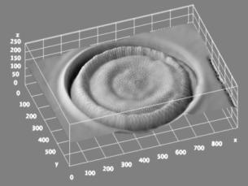
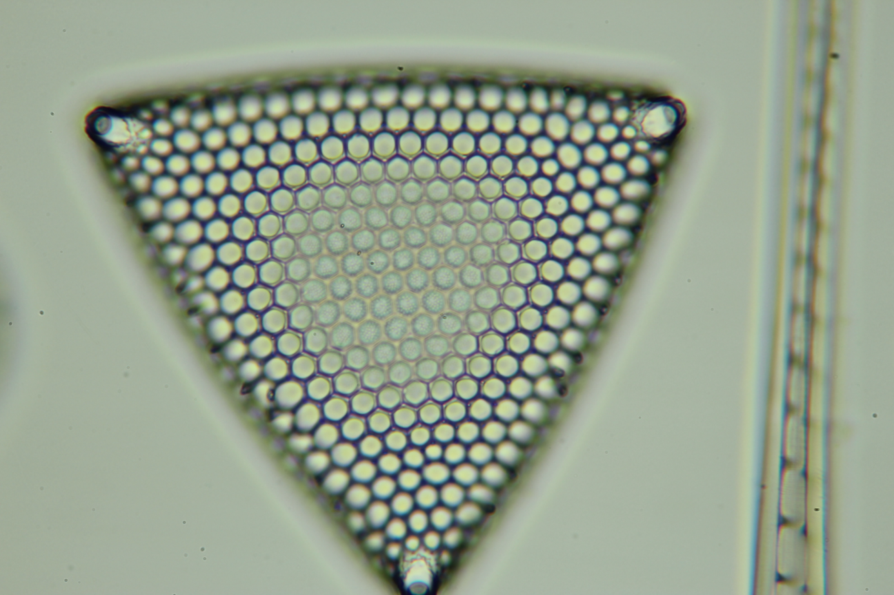
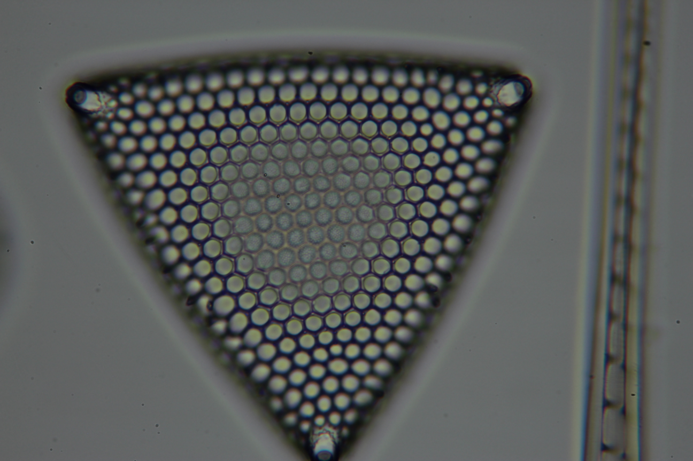
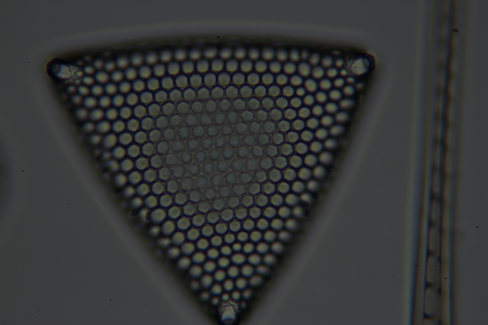
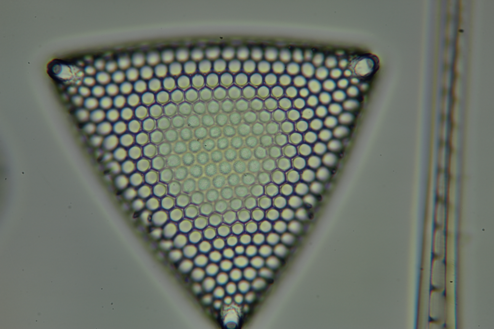

## MFusionJ
This innovative ImageJ plugin is designed to significantly enhance depth-of-field (DoF) by seamlessly merging a series of multi-focus images, enabling detailed analysis. Rigorous testing on multi-exposure image stacks has demonstrated its proficiency in preserving intricate details within both poorly and brightly illuminated regions of 3-D transparent diatom shells.

This capability is particularly valuable for images with limited DoF and varying exposure settings under low signal-to-noise ratio conditions. The plugin's effectiveness has been thoroughly validated through processing and analyzing numerous image stacks featuring diverse diatom and cyanobacteria species.

The methodology incorporates a sophisticated two-scale decomposition (TSD) scheme, enhanced by the refinement of weight maps using edge-preserving filtering (EPF). This dual approach ensures the preservation of fine details in the fused image while minimizing noise. These innovations make this plugin an invaluable tool for researchers and analysts working with complex image datasets. 

### Install
MFusionJ is a 64-bit plugin for ImageJ/Fiji, requiring ImageJ/Fiji to be installed on your computer.
To install MFusionJ:
1. Unzip the downloaded file.
2. Place the resulting MFusionJ folder into the 'plugins' directory of your local ImageJ/Fiji installation.
3. Open ImageJ/Fiji. If it is already open, restart it.
MFusionJ will now be accessible from the Plugins dropdown menu.

### Usage
First, convert the individual images to stacks by navigating through the Image menu:  Image->Stacks->Images to Stack 
* For multifocus images, apply the macro 'Fusion_multifocus.ijm'
* For multiexposure images, apply the macro 'Fusion_multiexposure.ijm'
  
The macros can accept both 8-bit and RGB stacks.

### Multifocus fusion example

Focus#1 | Focus#2  | Focus#3 |Fused result
:------:|:------:|:------:|:------:
|||

### 3D plot using the fused image as a texture on the surface
For a better visualization of the surface of the object the [Interactive 3D Surface Plot](https://imagej.net/ij/plugins/surface-plot-3d.html) plugin can be used.
3D plot |
:------: |

### Multiexposure fusion example

Exp.time: 1/60 | Exp.time: 1/100  | Exp.time: 1/160 |Fused result
:------:|:------:|:------:|:------:
|||

**If you find this work useful, please cite**:

	@inproceedings{singh24,
        author = {Harbinder Singh and Manuel G. Forero and Nuray Ağaoğlu and Gloria Bueno and Oscar Deniz and Gabriel Cristobal},
        title = {{An ImageJ plugin for image fusion based on edge-preserving filtering}},
        volume = {12998},
        booktitle = {Optics, Photonics, and Digital Technologies for Imaging Applications VIII},
        editor = {Peter Schelkens and Tomasz Kozacki},
        organization = {International Society for Optics and Photonics},
        publisher = {SPIE},
        pages = {129980Q},
        year = {2024},
        doi = {10.1117/12.3017408}
        }
**The preprint is available for access at [Digital CSIC](https://digital.csic.es/handle/10261/361518)**

