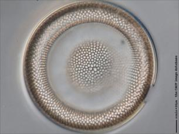
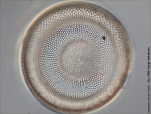
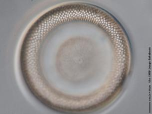
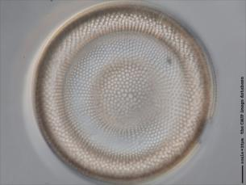

## MFusionJ
This novel ImageJ plugin is designed to significantly enhance the depth-of-field (DoF) by seamlessly merging a series of multi-focus images, allowing for in-depth analysis. The plugin has also been rigorously tested on multi-exposure image stacks, demonstrating its adeptness in preserving intricate details within both poorly and brightly illuminated regions of 3-D transparent diatom shells.

The significance of this capability becomes particularly apparent when dealing with images that exhibit a limited DoF and varying exposure settings under low signal-to-noise ratio conditions. The plugin's effectiveness has been thoroughly validated through the processing and analysis of numerous image stacks featuring diverse diatom and cyanobacteria species.

The proposed methodology incorporates a sophisticated two-scale decomposition (TSD) scheme, complemented by the refinement of weight maps using edge-preserving filtering (EPF). This dual approach ensures the preservation of fine details in the fused image while simultaneously minimizing noise. Such innovations make this plugin a valuable tool for researchers and analysts working with complex image datasets. 

## Multifocus fusion example

Focus#1 | Focus#2  | Focus#3 |Fused result
:------:|:------:|:------:|:------:
|||

**If you find this work useful, please cite**:

	@inproceedings{singh24,
	  author={Singh, H. and Forero, M. and Agaoglu, N. and Bueno, G. and Deniz, O. and Cristobal, G.},
	  booktitle={Proc. SPIE Optics, Photonics, and Digital Technologies for Imaging Applications (April 2024), Strasbourg, France},
	  title={An ImageJ plugin for image fusion based on edge-preserving filtering},
	  year={2024},
	  volume = {},
	  pages = {},
	  doi={}
	}

